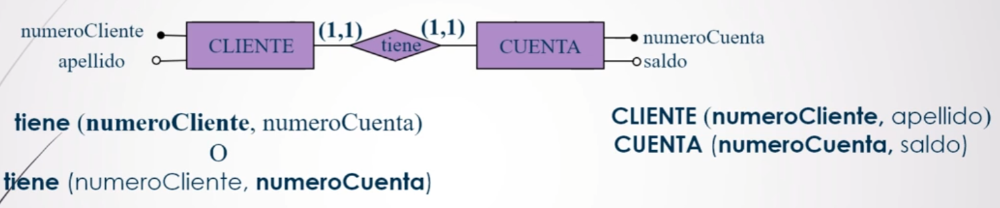
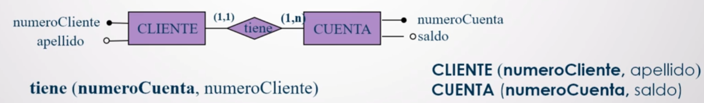
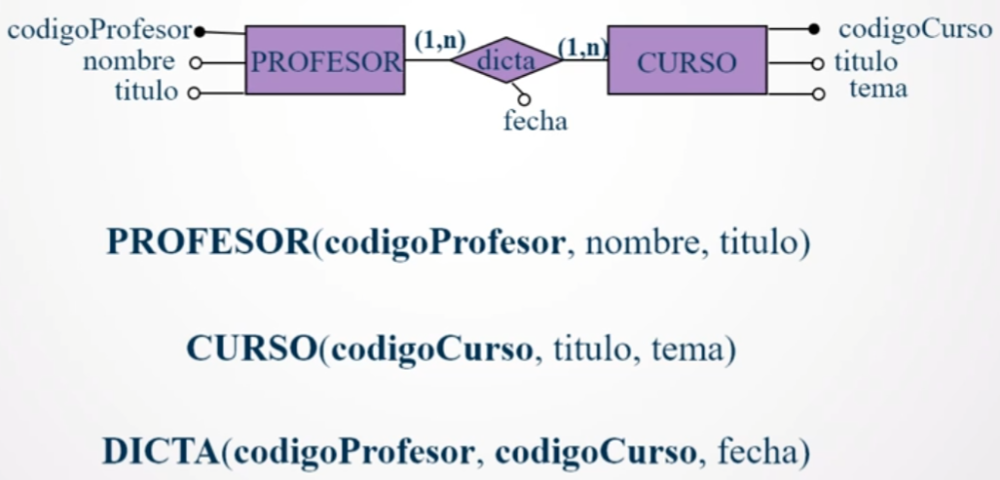
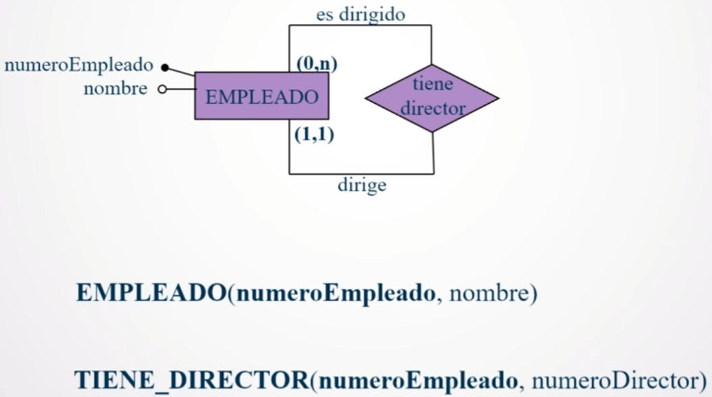
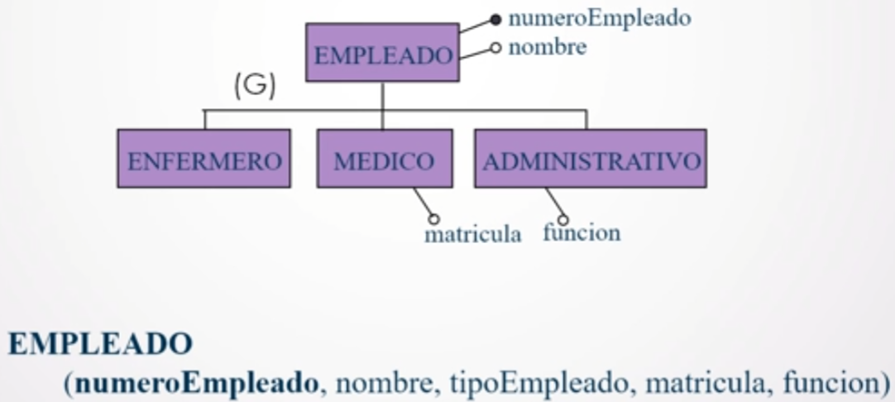
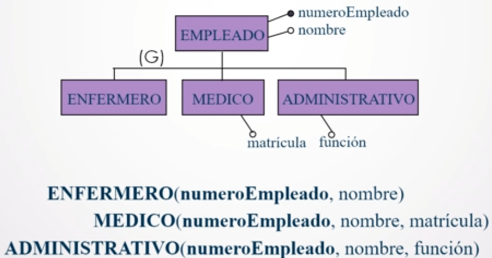
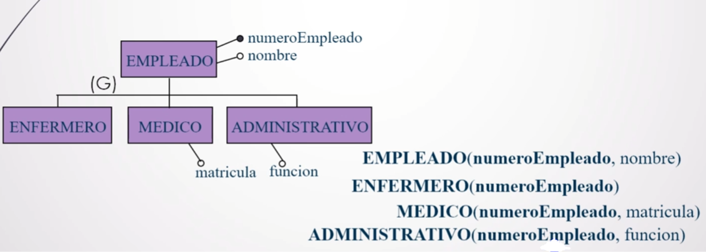
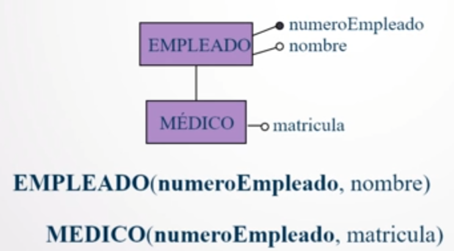
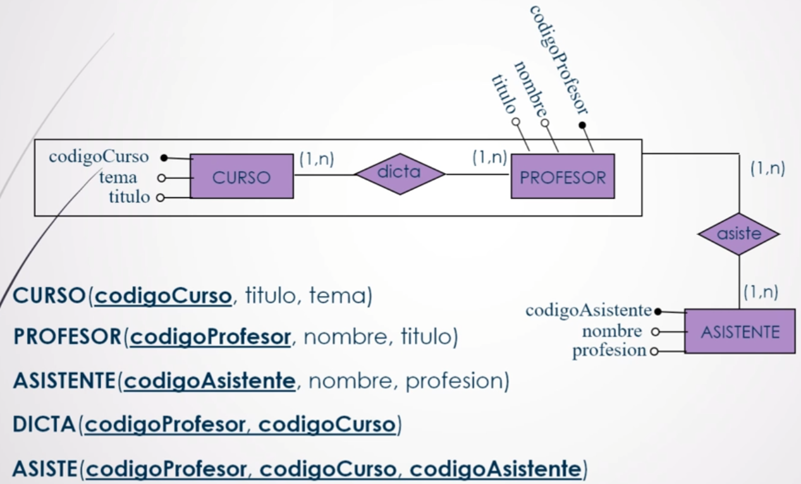

# Parte 2: transformación del modelo de entidades y relaciones al modelo relacional

## Glosario

+ **Relación**: se refiere siempre al **modelo relacional**, **excepto que se indique lo contrario**.
+ **Atributos**: se refiere siempre al **modelo relacional**, **excepto que se indique lo contrario**.

## Reglas

### Básicas

1. Convertir cada **entidad** en una **relación** con el **mismo conjunto de atributos**. Respetar el nombre. Tomar los atributos claves (modelo de entidades y relaciones) como parte del esquema de la relación.
2. Convertir cada **relación** (modelo de entidades y relaciones) en una **relación**. Respetar el nombre. Tomar los atributos (modelo de entidades y relaciones) de la relación (modelo de entidades y relaciones) como parte del esquema de la relación.

**IMPORTANTE**: si una **entidad** está involucrada **más de una vez en una relación** (roles), **se renombrará el atributo para evitar nombres duplicados**, adoptando el **nombre del rol de la entidad en la relación**.

### Para elementos ampliados

+ **Generalización**
	- Considerando el **nivel más alto**.
	- Considerando el **nivel más bajo**.
	- Creando **relaciones para ambos niveles**.
+ **Especialización**
	- Considerando el **nivel más alto**.
	- Creando **relaciones para ambos niveles**.
+ **Agregación**: la relación (modelo de entidades y relaciones) que vincula la agregación y la entidad aparte va a representarse como una **relación con una clave compuesta de tres atributos**: **los dos de la relación formada con la relación** (modelo de entidades y relaciones) **de adentro de la agregación** y el **restante de la clave de la relación formada con la entidad unida a la agregación**.

## Aplicación

### Básicas

#### Convertir una entidad-relación con cardinalidad (1,1)-(1,1)

Notar que, en este caso, se puede tomar tanto _numeroCuenta_ como _numeroCliente_ como **clave en la relación** ya que como la cardinalidad es (1,1)-(1,1), no tiene ninguna importancia.

#### Convertir una entidad-relación con cardinalidad (1,1)-(1,n)

En este caso, la elección de la **clave de la relación** es **bien clara**: es _numeroCuenta_ ya que el número de la cuenta **no se va a repetir** (porque partimos de que **la cuenta pertenece a uno y solo un cliente**), sin embargo _numeroCliente_ **podría repetirse** ya que **un cliente podría tener varias cuentas**.

#### Convertir una entidad-relación con cardinalidad (1,n)-(1,n)

En este caso, tanto _codigoProfesor_ como _codigoCliente_ **podrían repetirse más de una vez**, por lo que la **clave de la relación es la combinación de ambas**.

#### Convertir una entidad-relación con roles

En este caso, ocurre algo muy similar al segundo caso: la clave es _numeroEmpleado_ ya que **un empleado podría dirigir 0 o n empleados**, sin embargo **el empleado es dirigido por un y solo un empleado**. Dado que, entonces, hay **dos** _numeroEmpleado_, es que se **renombra el atributo que hace referencia al director** a _numeroDirector_. De esta forma, el numeroEmpleado (que efectivamente hace referencia a los empleados) **no se repite** y es el que queda como **clave**, dejando el esquema más claro.

### Para elementos ampliados

#### Transformar una generalización considerando el nivel más alto

En este caso, lo que se está haciendo es **colapsar todas las entidades** en una sola relación y se elige de clave el _numeroEmpleado_. Así, para distinguir cada empleado, es necesario **usar un atributo que diferencie cada uno** (_tipoEmpleado_, en este caso). También es interesante notar que tanto _matricula_ como _funcion_, dado que son atributos específicos según _tipoEmpleado_, **podrían tomar valores nulos**.

#### Transformar una generalización considerando el nivel más bajo

Este caso es lo contrario al anterior, es decir, **se despliegan las entidades de nivel más bajo** cada una en una relación diferente. La clave en cada una de ellas es _numeroEmpleado_. Notar que ahora _numeroEmpleado_ y _nombre_ **se repiten en cada relación** dado que son los campos que antes tenía la entidad _EMPLEADO_ que, si bien no está en el modelo, la información no debe perderse. También algo interesante es que **solo podrán representarse empleados que sean o bien enfermeros, médicos o administrativos**. 

#### Transformar una generalización creando relaciones

En este último caso, **se crea una relación por entidad** y se elije de clave a _numeroEmpleado_. Notar que la relacion _ENFERMERO_ quedó **solo con el número de empleado** y que también existe la relación _EMPLEADO_. Tambíen, en este último caso, **podrían haber empleados que no sean enfermeros, médicos o administrativos** (se modelarían bajo la relación _EMPLEADO_).

#### Transformar una especialización considerando el nivel más alto

Este caso es muy parecido al de la generalización: **se colapsan todas las entidades en una sola relación** y se elige de clave el _numeroEmpleado_. Así, para distinguir un empleado de un médico, es necesario **usar un atributo que diferencie cada uno** (_tipoEmpleado_, en este caso). También es interesante notar que _matricula_, dado que es un atributo específico según _tipoEmpleado_, **podría tomar valor nulo**.

#### Transformar una especialización creando relaciones

También muy parecido a la generalización: **se crea una relación por entidad** y se elije de clave a _numeroEmpleado_.

#### Transformar una agregación

Para este caso, tanto _CURSO_, _PROFESOR_, _ASISTENTE_ y _DICTA_, se tranforman de la forma en que se venía planteando hasta ahora.

Ahora bien, para _ASISTE_ hay que tomar **tres atributos** que conformarán la **clave**: **los dos de _DICTA_** (_codigoProfesor_ y _CodigoCurso_) y **el restante, la clave de ASISTENTE** (_codigoAsistente_).