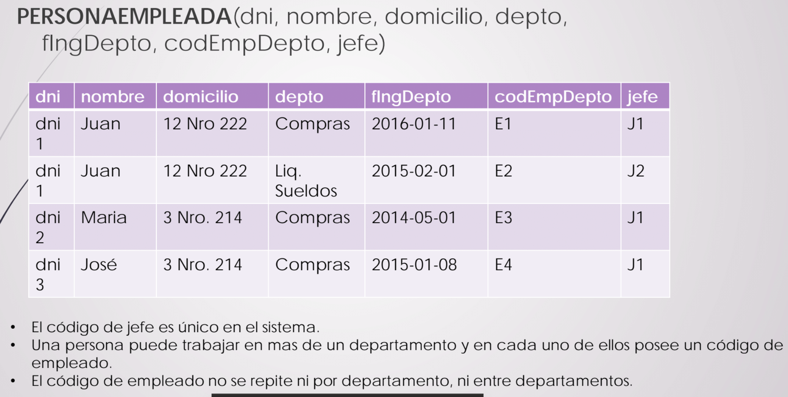
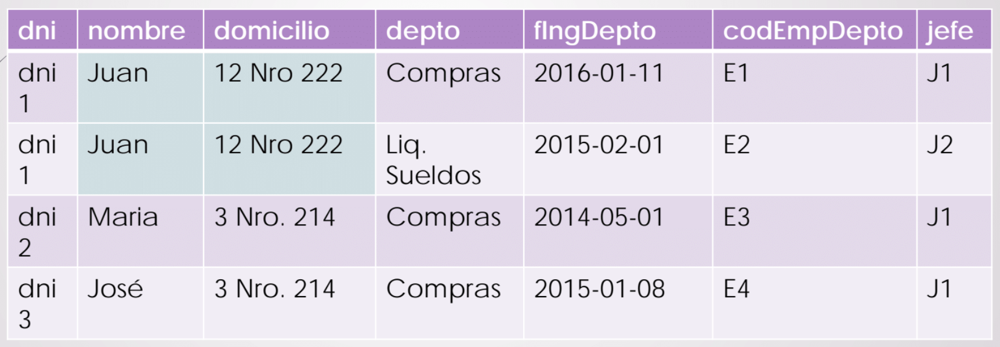
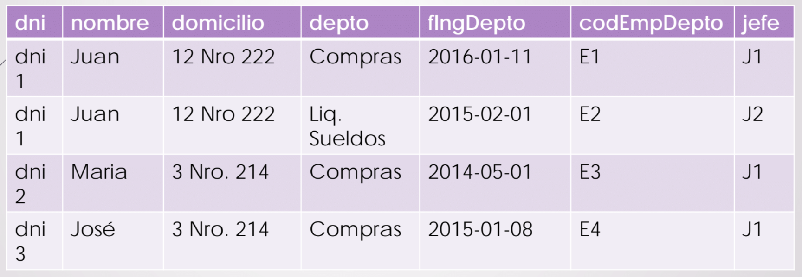

# Normalización

## Glosario

+ **BBDD**: base de datos.
+ **DF**: dependencia funcional.
+ **DFT**: dependencia funcional trivial.
+ **CC**: clave candidata.
+ **FN**: forma normal.
+ **1FN**: Primera Forma Normal.
+ **2FN**: Segunda Forma Normal.
+ **3FN**: Tercera Forma Normal.
+ **BCNF**: Forma Normal de Boyce y Codd (_Boyce Codd Normal Form_, en inglés).

## ¿Qué es la normalización y por qué normalizar?

La **deuda técnica** es un concepto clave para entender la importancia de la normalización. Se dice que existe una deuda técnica cuando, en el afán de realizar un **producto rápido** y **a bajo costo**, **se descuidan algunas partes de éste**. Muchas veces, **el descuido se da en la BBDD** y esto es lo que genera la necesidad de normalizar. La normalización parte de **una relación grande** y, **siguiendo reglas específicas**, la **descompone** y genera **relaciones más pequeñas** libres de **redundancia** y otras anomalías que suelen generarse durante la **inserción/eliminación**. Esto aumenta la **calidad** y la **consistencia** de los datos.

Se dice que para que una BBDD sea exitosa, primero su esquema de diseño debe ser bueno. Por lo general, un mal diseño conlleva a tener que refactorizar la BBDD completa y esto suele ser muy caro. Esto hace que el diseño del esquema de BBDD sea un factor muy predominante en el éxito de la BBDD, por lo que es algo a lo que hay que prestarle atención.

Hoy día, dado el volumen de datos que se maneja, refactorizar una base de datos es muy costoso (no solo hay que modificar la base de datos, sino también cómo se accede a la información). Esto y el hecho de que de los de buenos diseños solo salen buenas bases, hace que el diseño del esquema de BBDD sea un factor clave. La normalización no solo apunta a **mejorar la calidad de datos**, sino que también impacta sobre la **mantenibilidad** y **performance** de las bases.

Sin embargo, dado que es un proceso **lento** y que **requiere conocimiento muy específico**, muchas veces es **ignorado**. Esto hizo que se intentase **automatizar**, reduciendo así el **costo** de la normalización tradicional.

La normalización **solo puede aplicarse a bases de datos relacionales**, no así a las NoSQL. Algunos ejemplos de BBDD SQL son Oracle, MySQL, MS SQL Server, PostgreSQL, entre otras.

## Conceptos específicos

+ **Anomalía**: **problema** a raíz del **diseño** de una relación. Tomemos de ejemplo esta relación:

	

	Hay cuatro tipos:

	- **Redundancia**: información que se **repite innecesariamente** en diferentes tuplas.

		

	- **De actualización**: cuando se **actualiza** el valor de una tupla, **no se actualizan** aquellas que también deberían.

		

		Si quisiera actualizar el domicilio de Juan, debería actualizar tupla por tupla.

	- **De inserción**: insertar valores en ciertos atributos de una relación y no en otros me produce **valores nulos**.

		

		¿Qué pasaría si quisiera, por ejemplo, insertar solamente una persona que aun no tiene asignado un departamento?

	- **De eliminación**: borrar ciertos valores de una tupla podría llevarme a perder la **tupla completa**.

		

		¿Qué pasaría si solo quisiera borrar el dato del jefe? ¿Tendría que borrar sus empleados?

+ **Dependencia funcional (DF)**: es una **restricción** entre s**ubconjuntos de atributos** de una **misma relación**. De forma teórica: 

	```
	Si dos tuplas, t1 y t2, de una relación R coinciden en todos los atributos A1, A2, ..., An, entonces deben también coincidir en los atributos B1, B2, ..., Bn.
	```

	Lo anterior se escribe: _A1, A2, ..., An -> B1, B2, ..., Bm_ y se lee _A1, A2, ..., An_ **determina funcionalmente** a _B1, B2, ..., Bm_. Así, cuando se cumple una dependencia funcional, estamos indiciando una **restricción sobre todo R** y no sobre algunas de sus tuplas. Ejemplo:

	Dada ```PERSONA(dni, nombre, edad, fechaNacimiento)```, analizar sus restricciones. Una de ellas podría ser que **el dni es único por persona**. De ahí se desprende, entonces, la DF ```dni -> nombre, edad, fechaNacimiento```, la cual significa que si dos tuplas de la relación tienen el **mismo valor en el atributo dni**, **deben necesariamente tener los mismos valores en los atributos nombre, edad y fechaNacimiento**.

	Otro ejemplo:

	Si la relación fuera ```PERSONA(dni, nombre, edad, fechaNacimiento, nroLegajo)``` y las restricciones:
	+ Una persona posee un único número de legajo asignado.
	+ Un número de legajo pertenece a un sola persona.
	
	Entonces, se podrían enunciar las siguientes DF:
	+ ```dni -> nombre, edad, fechaNacimiento, nroLegajo```.
	+ ```nroLegajo -> nombre, edad, fechaNacimiento, dni```.

	Un último ejemplo: 

	Si la relación fuera ```PERSONA(dni, nombre, edad, fechaNacimiento, nroLegajo, carrera)``` y las restricciones:
	+ Una persona puede cursar diversas carreras.
	+ Nombre indica cómo se llama la persona.
	+ Una persona posee un único número de legajo asignado para cada carrera.
	+ Un número de legajo pertenece a una sola persona de una carrera.

	Entonces, podría enunciar las siguientes DF:
	+ ```dni -> nombre, edad, fechaNacimiento, nroLegajo```.
	+ ```nroLegajo, carrera -> dni```.
	+ ```dni, carrera -> nroLegajo```.

	Notar que en la segunda DF, nroLegajo y carrera **no deteminan funcionalmente también a dni**. Esto es así ya que en la DF anterior (la de dni) **ya aparecen esos atributos**. Es por esto que se dice que la DF debe ser lo más **mínima** posible.

+ **Dependencia funcional trivial (DFT)**: idem DF pero agrega el hecho de que _B1, B2, ..., Bm_ está incluído en _A1, A2, ..., An_.

	Ejemplo:

	Dada la relación ```CONTRATADO(nroContratado, dni, nombrePersona, inicioActividad)``` y sus DFs:
	+ ```dni -> nombrePersona```
	+ ```nroContratado, dni -> inicioActividad```

	Sus DFs triviales serían:
	+ ```dni -> dni```
	+ ```nroContratado, dni -> nroContratado```

	Entender este concepto es clave para luego entender _BCNF_.

+ **Clave**: se dice que los atributos {A1, A2, ..., An} son la **clave** de una relación R si éstos **determinan funcionalmente a todos los restantes atributos de R** y **no existe un subconjunto más chico** que determine funcionalmente todos los atributos, es decir, la clave debe ser **minimal**.

	Por ejemplo, en la relación ```PERSONA(dni, nombre, edad, fechaNacimiento)```, siendo ```dni -> nombre, edad, fechaNacimiento``` la DF, entonces dni es la clave.

	- **Clave candidata (CC)**: cuando se da el caso de que existe **más de una clave** en una relación, se dice que ambas son **CCs** ya que **cualquiera de las dos podría ser clave**. Ejemplo:

		Dada la relación ```PERSONA(dni, nombre, edad, fechaNacimiento, nroLegajo)```, en la que las DFs son ```dni -> nombre, edad, fechaNacimiento, nroLegajo``` y ```nroLegajo -> nombre, edad, fechaNacimiento, dni```, se dice que tanto {dni} como {nroLegajo} son CCs.

		Otro ejemplo:

		Si la relación fuera ```PERSONA(dni, nombre, edad, fechaNacimiento, nroLegajo, carrera)``` y las DFs: ```dni -> nombre, edad, fechaNacimiento, nroLegajo```, ```nroLegajo, carrera -> dni``` y ```dni, carrera -> nroLegajo```, entonces las CCs serían {nroLegajo, carrera} y {dni, carrera}. Notar que dni o nroLegajo no son CCs ya que **NO** pueden representar al resto de los atributos.

		**NOTA**: si hay una sola clave, ésta es **clave** y **CC** a la vez.

	- **Superclave**: idem clave pero podría no ser **_minimal_**, es decir, volviendo al primer ejemplo de clave, {dni, nombre} sería una superclave. Notar que la clave **está siempre incluída en cualquier superclave**. También la propia clave es, al mismo tiempo, superclave.

Ahora bien, muy bonito el concepto de clave pero ¿Cómo estoy seguro que un conjunto de atributos {A1, A2, ..., An} permite recuperar al resto de los atributos de la relación? (o en criollo, **que la DF efectivamente recupera todos los atributos**) Esto se puede determinar fácilmente con el concepto de **clausura de atributos**.

## Clausura de atributos (X+)

Sea **F** un conjunto de **dependencias funcionales** sobre un **esquema R**, y sea **X** un **subconjunto** de **R**, la **clausura** de X (**X+**) respecto de F es el **conjunto de atributos A** tal que la dependencia **X -> A** puede deducirse a partir de **F** usando los axiomas de Armstrong.

En resumen, el algoritmo para determinar la clausura de X respecto de F es:

```
result := X
while (result cambió)
do
	for (cada DF Y -> Z en F)
	do
		if (Y ⊆ result) then
			result := result ∪ Z
		endif
	endfor
endwhile
```

Ejemplo de uso:

Si la relación fuera ```PERSONA(dni, nombre, edad, fechaNacimiento, nroLegajo, carrera)``` y las DFs (**F**) fueran: ```dni -> nombre, edad, fechaNacimiento, nroLegajo```, ```nroLegajo, carrera -> dni``` y ```dni, carrera -> nroLegajo```, entonces las CCs serían {nroLegajo, carrera} y {dni, carrera}.

En ese punto, la pregunta sería: ¿Es cierto que a partir de {nroLegajo, carrera} se pueden recuperar el resto de los atributos? Aplicando el algoritmo, X+ sería PERSONA, X sería {nroLegajo, carrera} y F serían las DFs.

Entro en el _while_ porque _result_ "cambió" (fue seteada la variable). Itero sobre cada DF:
1. ```dni -> nombre, edad, fechaNacimiento, nroLegajo```: ¿Está {dni} incluído en _result_? No, por lo que avanzo a la siguiente DF.
2. ```nroLegajo, carrera -> dni```: ¿Está {nroLegajo, carrera} incluído en _result_? Si, por lo que agrego a {dni} a _result_. Tener en cuenta que _result_ acaba de cambiar.
3. ```dni, carrera -> nroLegajo```: ¿Está {dni, carrera} incluído en _result_? Si, por lo que agrego a {nroLegajo} a _result_. Tener en cuenta que _result_ volvió a cambiar.

Ahora el _while_ pregunta ¿_result_ cambió? Si, por lo que vuelvo a entrar en el while. Itero, nuevamente, sobre cada DF:
1. ```dni -> nombre, edad, fechaNacimiento, nroLegajo```: ¿Está {dni} incluído en _result_? Ahora sí está incluído, por lo que agrego {nombre, edad, fechaNacimiento, nroLegajo} a _result_.

En este punto ya es podemos parar porque _result_ = X+ (efectivamente, partiendo X pude recuperar todos los atributos).

Ahora bien, **sabiendo que una clave es clave**, queda un último misterio ¿**Cómo deducir nuevas DFs**? Acá es donde aparecen los **axiomas de Armstrong**.

## Axiomas de Armstrong

Los axiomas de Armstrong permiten **inferir nuevas DFs** a partir de un **conjunto que resultó ser evidente**. Aplicándolos, hallo un **conjunto completo** y **seguro** en donde todas son **correctas**. Sin embargo, es posible que algunas de ellas sean **triviales**.

Hay dos tipos de axiomas:

+ **Básicos**:
	- **Reflexión**: X es un conjunto de atributos e Y ⊆ X, entonces X->Y.
	- **Aumento**: si X->Y, siendo Z un conjunto de atributos, entonces Z,X->Z,Y.
	- **Transitividad**: si X->Y e Y->Z, entonces X->Z.
+ **Deducidos** a partir de los básicos:
	- **Unión**: si X->Y y X->Z, entonces X->Y,Z.
	- **Descomposición**: si X->Y,Z, entonces X->Y y X->Z.
	- **Pseudotransitividad**: si X->Y e Y,Z->W, entonces X,Z->W.