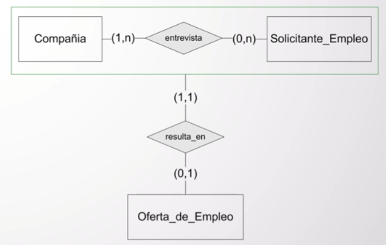

# Parte 1: modelo de datos

## Glosario

+ **BBDD**: Base de datos.

## Modelo de datos

Es aquel que provee una notación para describir los datos. Para esto, requerimos de los datos:

+ Su **estructura**
+ Sus **restricciones**
+ Sus **operaciones** (opcional)

Constituye la **estructura subyacente** de una BBDD. Manejan diferentes **niveles de abstracción**.

## Clasificación de modelos de datos

Una posible clasificación es:

+ **Modelos lógicos**
	- **Basados en objetos**
		* **Modelo Entidad-Relación**
		* **Modelo Orientado a Objetos**
	- **Basados en registros**
		* **Modelo relacional**
+ **Modelos físicos**

Este tipo de clasificación discrimina los modelos según su **expresividad** y según los **elementos** que se empleen para representar los datos.

## Modelo Entidad-Relación

Es una **abstracción del mundo real** que representa el **significado de los datos** pero que es **independiente de la implementación física**. Siguiendo el esquema definido en [modelo de datos](#modelo-de-datos):

+ **Estructura**
	- **Entidad**: una **cosa** que puede ser **identificada y distinguida** de otra. Varias entidades del mismo tipo forman un **conjunto de entidades**. Ejemplo: un **auto** con una determinada patente y una **persona** con un determinado dni.
	- **Relación**: **asociación** entre **entidades**. Las asociaciones entre entidades del mismo tipo forman **conjuntos de relaciones**. Ejemplo: una determinada persona **es dueña de** un determinado auto. 
	- **Atributo**: **información** acerca de una **entidad** o una **relación**. Los atributos tienen un **dominio**, esto es, el **conjunto de valores** que pueden tomar. Ejemplo: de la entidad _auto_, un atributo sería la **patente**, la cual puede tomar **hasta seis letras del abecedario o dígitos** (ACM1PT); de la relación _es dueño de_, podría ser la **fecha** en que la persona se convirtió en dueña del auto. A su vez, el dominio de la fecha podría ser un **número de ocho dígitos** (19971121).
	- **Rol**: **función** que tienen las **entidades** en una **relación** cuando **la entidad es la misma**. Ejemplo: siendo José, con dni 1234567, **tutor de** Juan, con dni 23456789, entonces el **rol** de Juan es **tutelado por** Jose.
+ **Restricciones**
	- **Cardinalidad**: **número de veces** que una **entidad** puede **participar** en una **relación**. La cardinalidad es importante dado que una entidad podría participar, por ejemplo, **0 veces** en una relación. De esta forma, la cardinalidad indica **qué tan dependiente es la relación de esa entidad**, pudiendo así ser **total**, si la participación ha de ser **obligatoria**; o **parcial**, si la participación es **opcional**. Así, si consideramos dos entidades, A y B, y las relaciones binarias R entre ellas, las cardinalidades (considerando los extremos máximos de cada lado de R) pueden ser:
		* **Uno a uno**
		* **Uno a muchos**
		* **Muchos a muchos**
	- **Grado**: **máximo valor** que toma una **cardinalidad**. Ejemplo: si una cardinalidad es uno a muchos, entonces el grado es **n**.
	- **Identificador**: es un **atributo** que toma un **valor único** para cada **entidad**, logrando de esta forma **distinguir la una de la otra**. El identificador es **obligatorio** para cada **entidad**. Éste puede ser:
		* **Simple**
		* **Compuesto**

	Es importante notar que el identificador **está relacionado con la entidad** y no con la relación.

## Diagrama Entidad-Relación

Es la **representación gráfica** de la estructura de los datos.

Las **entidades** se representan con un **rectángulo** en el cual adentro se define el nombre de ésta. Los nombres de las entidades **no pueden repetirse** ni entre ellas, ni con las relaciones.

Los **atributos**, por otro lado, se representan con un **círculito con una línea** en el cual se define su nombre. Los atributos tienen un nombre único **dentro de la entidad/relación** en la que estén. Esto significa que podrían haber varias entidades con un atributo *nombre*, por ejemplo. 

Si el **circulito no está pintado**, entonces el atributo es de tipo **descriptor**; mientras que **si el circulito está pintado**, entonces el atributo es **identificador**.

Finalmente, cuando el identificador es **compuesto**, éste se representa a partir de los **distintos atributos descriptores y se traza una línea horizontal con un circulito pintado en el medio** para indicar que el identificador es el conjunto de tales atributos.

Por su parte, las **relaciones** se representan con un **rombo** en el cual adentro se define el nombre de ésta.

Las relaciones también tienen un **nombre único** que tampoco puede repetirse entre otras relaciones o entidades. También, las relaciones **pueden tener atributos**, siempre y cuando éstos sean solo **descriptores**.

Por último, la **cardinalidad** se representa como un **par**, indicando la mínima y la máxima a cada lado de la relación. La cardinalidad, de esta forma, también determina el **grado** de cada relación.

Para ilustrar todo lo anterior, se puede tomar como ejemplo el siguiente modelo

En este caso, _Persona_ y _Auto_ son las **entidades**, mientras que *tiene* es la **relación** entre ambas entidades.

De _Persona_ podemos decir que _dni_ es el **identificador**, mientras que _nombre_, _apellido_ y _fecha\_nacimiento_ son sus **atributos**. En el caso de _Auto_, patente es el **identificador** y color, su **atributo**.

A su vez, las **cardinalidades** de la relación *tiene* se leen de la siguiente manera:

+ Una persona puede tener 1 o n autos.
+ Un auto es poseído por 1 y solo 1 persona.

También, es conveniente ilustrar un ejemplo de **rol**:

En este caso, Persona es la única **entidad** y _es\_superior\_de_, la **relación**. De _Persona_ podemos decir que _dni_ es el **identificador**, mientras que _nombre_, _apellido_ y _fecha\_nacimiento_ son sus **atributos**.

En el caso de la relación, _es\_superior\_de_, está relacionando dos veces a la misma entidad. Así, la **cardinalidad** se lee de la siguiente manera:

+ Una persona es superior de 0 o n personas.
+ Una persona, también, trabaja como mucho para una persona.

Por último, algunas combinaciones de cardinalidades:

## Ampliando el modelo Entidad-Relación

### Especialización

Es tomar un **subconjunto de entidades** de un **nivel determinado** para formar un **conjunto de entidades de nivel más bajo**.

Ejemplo: supongamos que en un hospital existen _médicos_ y _empleados_. De los _médicos_ nos interesa saber la matrícula. No todos los _empleados_ son _médicos_, por lo que en este caso **especializamos** al médico (subconjunto) de los empleados. La forma de representar una especialización es con una flecha **apuntando a la entidad más general** e indicando una (E).

### Generalización

Es el **proceso inverso a la especialización**, es decir, tomar un **conjunto de entidades de un nivel bajo** con **características en común** y **formar una entidad de nivel más alto**.

Ejemplo: tengo _cajas de ahorro_ y _cuentas corriente_. En este caso, tanto la _caja de ahorro_ como la _cuenta corriente_ comparten un atributo (el número de cuenta), por lo que **generalizo** creando una entidad de nivel superior con esos atributos compartidos. La forma de representar a la generalización es con una flecha **apuntando a la entidad más general** (la recién creada) e indicando una (G).

#### Especialización vs. Generalización

A priori, el mecanismo de abstracción, es decir, lo que indica si es una generalización o a una especialización, es diferente ([consultar las definiciones](#ampliando-el-modelo-entidad-relación)), si bien visualmente son lo mismo. Otra diferencia, es que **las generalizaciones no conciben entidades que no estén representadas en las hojas** (yendo al ejemplo, no hay otras cuentas aparte de la caja de ahorro y la cuenta corriente); mientras que **la especialización si podría considerar otros tipos**.

### Agregación

Es un **mecanismo de abstracción** en el cual **una relación binaria** (junto con sus dos entidades relacionadas) se trata como una **entidad de alto nivel**. Este mecanismo surge como consecuencia de que en el modelo Entidad-Relación tradicional **no se puede relacionar dos relaciones**. Solo es posible agregar cuando la **cardinalidad** para cada entidad de la relación es **mayor a 1**.

Ejemplo: supongamos que se guardan *entrevistas* de _solicitantes de empleo_ a varias *compañías*.

Ahora bien, también es necesario representar que algunas _entrevistas_ resultan en _ofertas de empleo_, mientras que otras no. Es acá cuando aparece la agregación.

Como se puede apreciar, dentro de la agregación las cardinalidades de la relación son mayores a 1 (n). Por su parte, las cardinalidades entre la abstracción y _Oferta\_de\_Empleo_ representan lo que sigue:

+ Una entrevista podría resultar o no en una oferta de empleo.
+ Una oferta de empleo pertenece a una y solo una entrevista.

## Modelo relacional

Es un modelo de datos lógico basado en registros, es decir, respeta la definición de [modelo de datos](#modelo-de-datos). Este modelo representa:

+ **Estructura**:
	- **Relaciones**: tablas bidimensionales que contienen los datos. Ejemplo: Persona.
	- **Atributos**: cada columna de la tabla/relación. Ejemplo: dni, edad, nombre.
	- **Esquema**: el conjunto de una relación y sus atributos. Ejemplo: _Persona (dni, edad, nombre)_. **ACLARACIÓN**: los atributos de un esquema son un conjunto y no una lista, lo cual significa que no siguen un criterio de ordenación.
	- **Tuplas**: fila de cada relación sin considerar la primera (la de los encabezados). Están formadas por valores concretos. Ejemplo: (12345678, 54, Juan).
	- **Dominio**: el tipo de cada tupla. Debe ser atómico (esto es, una palabra o un número), nada de listas o registros.
	- **Clave**: conjunto de atributos que siempre es único en todas las tuplas de la relación. Ejemplo: Persona(**dni**, edad, nombre).
+ **Restricciones**:
	- No hay tuplas repetidas (cada fila es única).
	- El orden de las filas no significa nada en particular (conjuntos).
	- El orden de las columnas no significa nada en particular (conjuntos).
	- Los valores de los atributos de una relación deben ser atómicos (nada de listas/registros).