# Álgebra relacional

Dos partes muy importantes:

+ Lenguaje de **consulta**.
	- Operaciones **fundamentales**.
	- Operaciones **adicionales**.
+ Lenguaje de **manipulación**.
	- Operaciones de **manipulación**.

## Lenguaje de consulta

Utilizan operaciones para **recuperar información**. Existen dos tipos de operaciones:
+ **Operaciones fundamentales**: las **suficientes** para expresar **cualquier consulta** en álgebra relacional.
+ **Operaciones adicionales**: **no agregan potencia al álgebra**, solo **simplifican consultas**. Aportan **legibilidad** a lo que se esté representando. Son **re-escribibles** en términos de operaciones fundamentales.

Se pueden usar en forma aislada o en conjunto (expresiones), permitiendo de esta forma resolver consultas complejas. Cuando sea necesario agruparlas, usar paréntesis para indicar orden de ejecución.

**IMPORTANTE**: antes de seguir, hay que entender la diferencia entre operación **unaria** y **binaria**. Las operaciones **unarias** involucran **una relación**; las **binarias**, **dos**.

**IMPORTANTE x2**: algunas de las operaciones que siguen, para poder ejecutarse, exigen que las relaciones sean **unión compatible**, es decir, teniendo dos relaciones A y B, para que éstan sean unión compatible, **todos los atributos de A han de estar en B** y **en el mismo orden**.

### Operaciones fundamentales

+ **Selección**: operación unaria que, **a partir de una condición**, se queda con **aquellas tuplas que la cumplan**. La condición puede ser **simple** o **compuesta** y podría incluir **operadores lógicos** tales como _AND_, _OR_ o _NOT_. Ejemplo:

	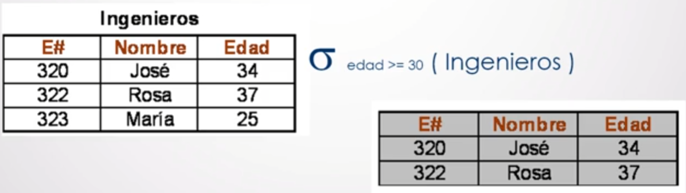

+ **Proyección**: operación unaria que, **dada una lista de atributos**, "corta" la relación dejando **solo los atributos en la lista**. Ejemplo:

	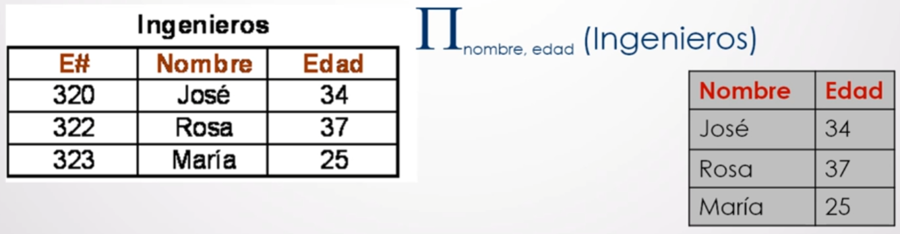

_Selección vs. proyección_: notar que si bien son operaciones **similares**, **el corte es diferente**, es decir, la selección **corta horizontalmente** (tuplas), mientras que la proyección **corta de forma vertical** (atributos).

+ **Producto cartesiano**: operación binaria que **relaciona** todos los **atributos** de la **relación A** con los de la **relación B**. Ejemplo: 

	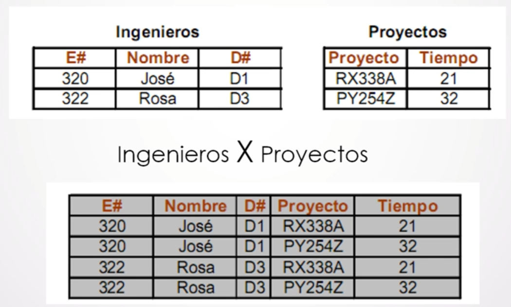

	En este segundo caso, se puede apreciar que existirían **dos campos iguales** al realizar la operación (E#). Dado que eso **no es posible**, es que se usa **notación puntual**, es decir, **indicar a qué relación pertenece tal atributo**.

	

+ **Renombre**: operación unaria que **cambia** tanto el **nombre de alguna relación** como de sus **atributos**. Ejemplo de renombre de relacion:

	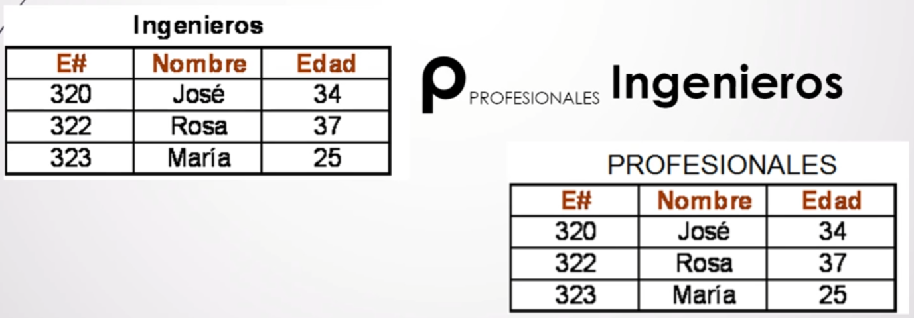

	Ejemplo de renombre de atributos junto con relación:

	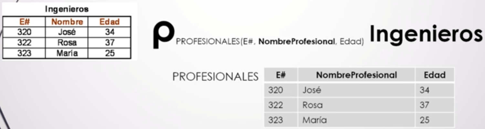

	Es importante notar que el renombre cambia el nombre de los atributos **de izquierda a derecha**.

	El renombre es particularmente útil cuando es necesario realizar alguna operación binaria que involucre **la misma relación a ámbos lados**. En tal caso, lo que se hace **antes de realizar tal operación** es renombrar las relaciones (o una de las relaciones) para que no se llamen igual.

+ **Unión (A U B)**: operación binaria en la que se genera una relación con **los elementos de A más los no repetidos de B**. Equivale a la unión de conjuntos. Requiere de **unión compatible**.

	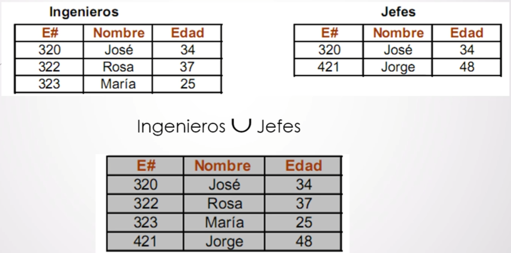

+ **Diferencia (A - B)**: operación binaria que produce una relación en la que están **los elementos de A que no pertenezcan a B**. Equivale a la diferencia de conjuntos. Requiere de **unión compatible**.

	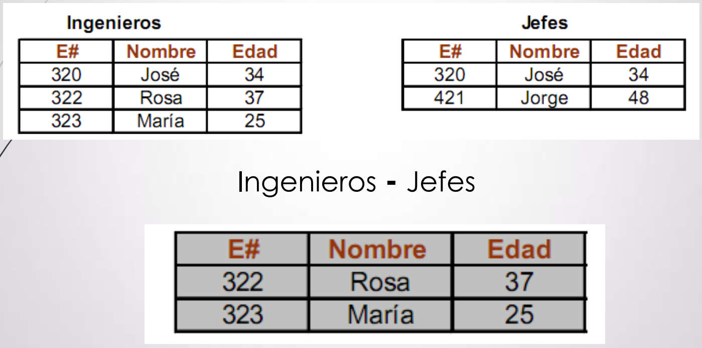

### Operaciones adicionales

+ **Intersección**: operación binaria que da aquellas **tuplas** que pertenecen a **ámbas relaciones**. La intersección equivale a A - (A - B). Equivale a la intersección de conjuntos. Requiere de **unión compatible**.

	

+ **Producto Theta**: operación binaria que genera una nueva **relación** con las **tuplas resultantes** de aplicar una **selección** con una **condición _x_** sobre un **producto cartesiano**. La condición _x_ es una **expresión booleana** que podría involucrar **más de un conector lógico**. El producto theta equivale a una selección sobre un producto cartesiano.

	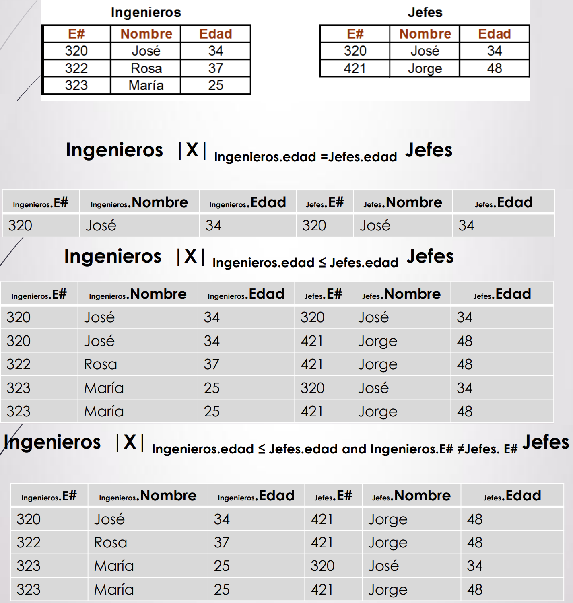

+ **Producto Natural**: operación binaria que genera una nueva **relación sin repetidos** con las **tuplas resultantes** de aplicar una **selección** sobre un **producto cartesiano**. La condición de la selección son **todos los atributos de A que estén en B** y **sean iguales**. A su vez, luego de la selección, **se aplica una proyección _y_** que elimina **columnas repetidas** y **atributos que no estén en común entre A y B**. Así, el producto natural es un producto cartesiano al que se le aplica la selección con condición _x_ y luego la proyección _y_.

	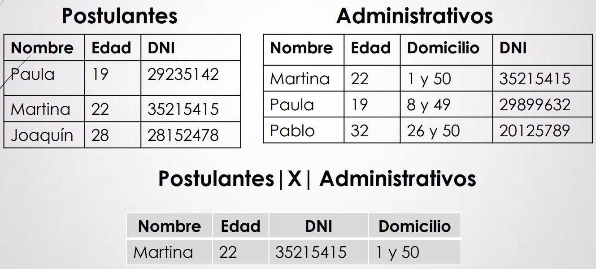

	**Producto natural vs. producto theta**: si bien en términos teóricos parecen similares, hay dos diferencias importantes:
	+ En el producto theta, la condición _x_ de la selección **puede ser cualquiera**, mientras que en el producto natural ésta **ya está definida**.
	+ El producto theta **no elimina las columnas duplicadas** y utiliza la notación puntual para expresarlas, mientras que el producto natural **elimina las tuplas duplicadas y aquellas que no estén en común entre A y B** mediante la proyección.

+ **División**: operación binaria que involucra un dividendo A y un divisor B, en la que **los atributos de B han de ser un subconjunto de los atributos de A** y deben tener **el mismo dominio**. Así, la división posee **los valores de A en combinación con todas las tuplas de B**. La división equivale a esto:

	

	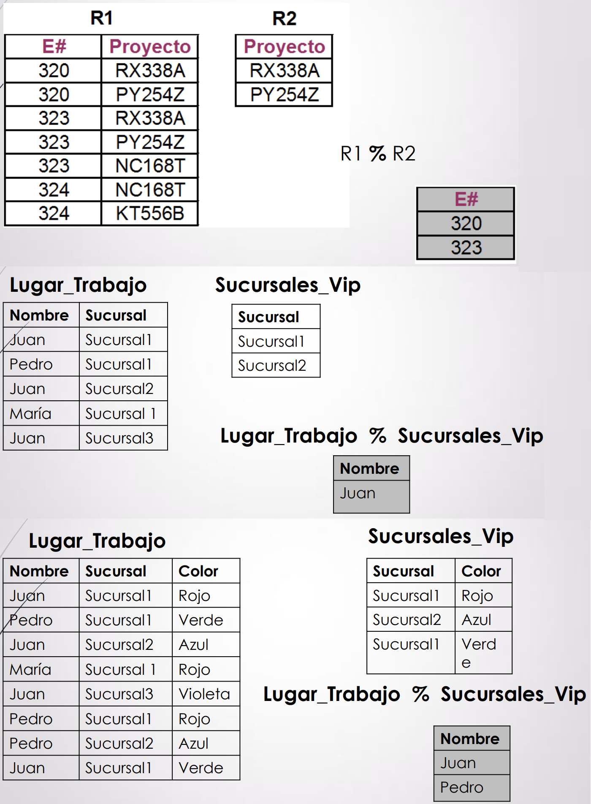

+ **Asignación**: es una forma conveniente de **expresar operaciones complejas**, aportando **modularidad** a las operaciones. La idea es **asignar** el **resultado de una operación** a una **variable** y luego **usar el resultado** tantas veces como sea necesario. Esta operación aporta **legibilidad** a las consultas.

	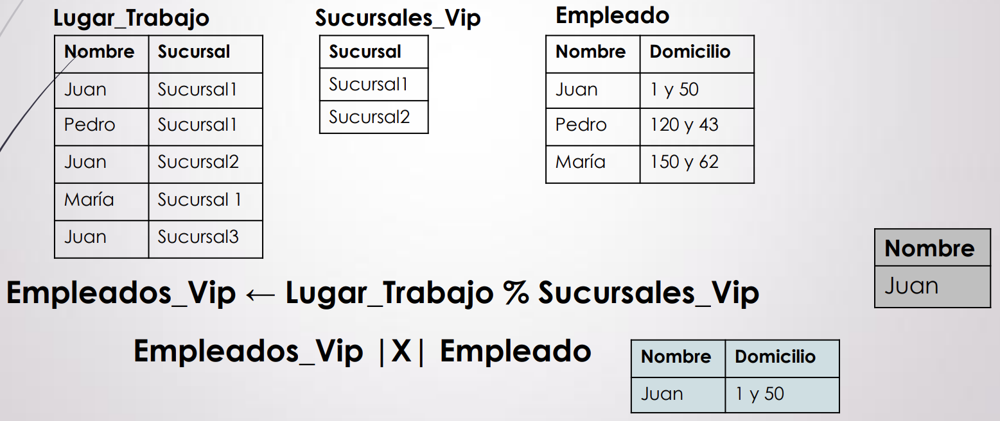

## Lenguaje de manipulación de datos

+ **Lenguaje de manipulación**: operaciones para, por ejemplo, **agregar o sacar datos**.
	- **Operaciones de manipulación**: **modifican** la cantidad o los valores de las tuplas de una relación. Se expresan usando la operación de **asignación**.

### Operaciones de manipulación

+ **Inserción**: operación que permite **insertar tuplas** en la relación. Para poder insertar tuplas, éstas deben ser **compatibles** con la relación. Pueden insertarse **una o varias tuplas** y también el **resultado de una operación** (siempre y cuando el resultado sea **compatible**).

	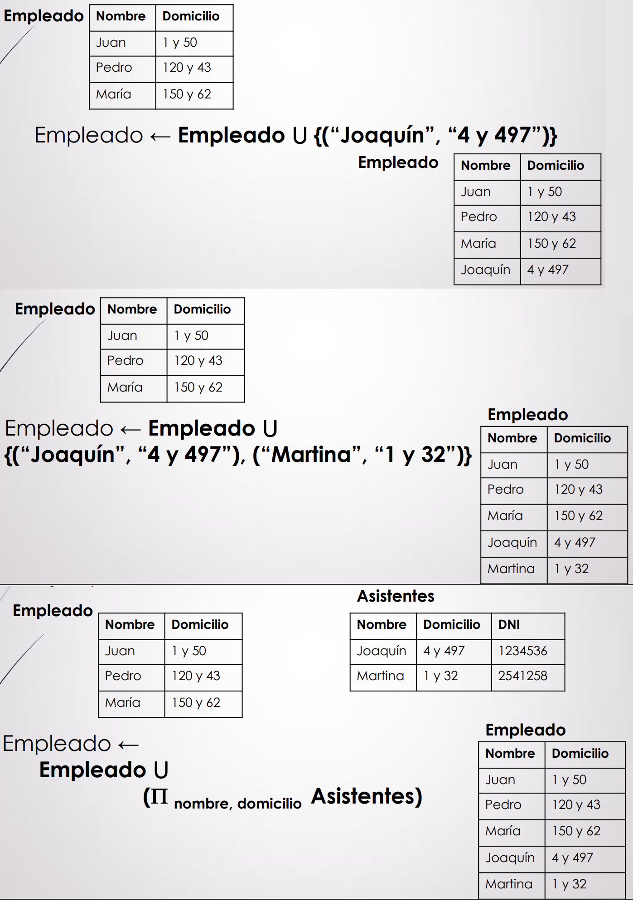

+ **Eliminación**: operación que permite **eliminar tuplas** de la relación. Para poder eliminar tuplas, éstas deben ser **compatibles** con la relación. Pueden eliminarse **una o varias tuplas** y también el **resultado de una operación** (siempre y cuando el resultado sea **compatible**).

	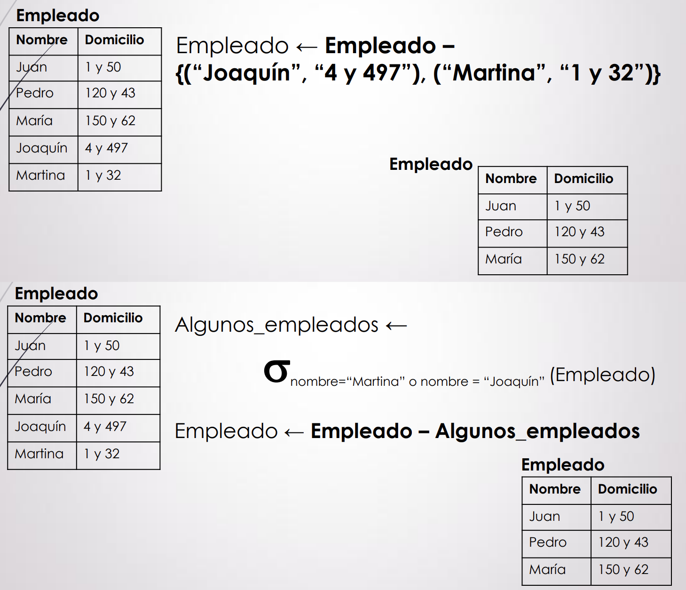

+ **Actualización**: operación que permite **actualizar** el valor de una tupla.

	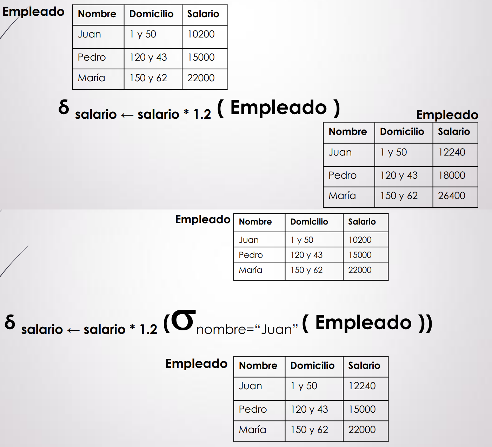