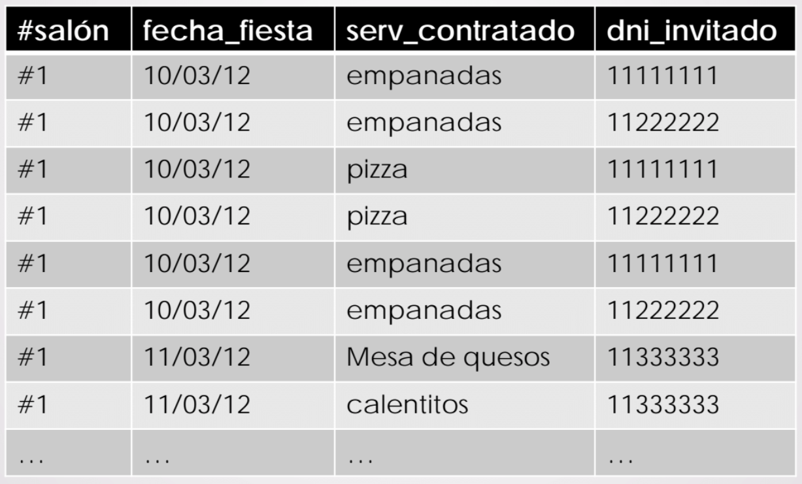
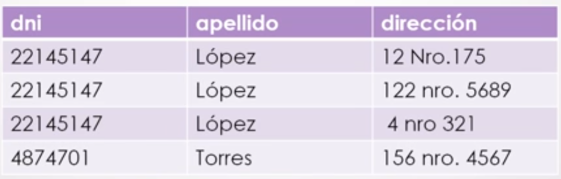
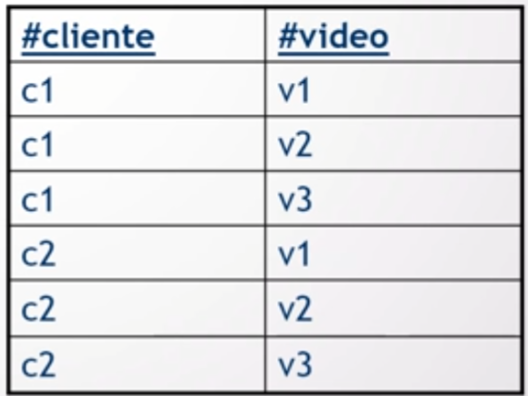

# Redundancias

## Glosario

+ **BCNF**: _Boyce Codd Normal Form_.
+ **DM**: dependencia multivaluada.
+ **DMT**: dependencia multivaluada trivial.
+ **4FN**: cuarta forma normal.
+ **DF**: dependencia funcional.
+ **CC**: clave candidata.
+ **CP**: clave primaria.

## Introducción

Retomando el primer esquema que fue normalizado (FIESTAS), quedaron 4 particiones producto de BCNF:

```
F1 (--#salon--, direccion, capacidad)
F3 (--dni_invitado--, nombre_invitado)
F5 (--#salon--, --fecha_fiesta--, --dni_invitado--, mesa_invitado)
F6 (--#salon--, --fecha_fiesta--, --servicio_contratado--, --dni_invitado--)
```

¿Cómo podría ser una instancia de F6?



Lo que salta a la vista es que **se está repitiendo**, por ejemplo, el servicio para una misma fecha para un mismo salón. Esto es lo que se conoce como **redundancia** y hay dos conceptos importantes para tratarlas:

+ **Dependencia multivaluada** (DM).
	- **Dependencia multivaluada trivial** (DMT).
+ **Cuarta Forma Normal** (4FN).

## Dependencia multivaluada

Una DM afirma que dos o más atributos son **independientes** del resto. Esta independencia es lo que genera la **redundancia**, es por eso que no se puede eliminar con las DFs.

**Definición teórica:** se dice que X -->> Y(se lee _X multidetermina a Y_) si dado un valor X, hay un conjunto de valores de Y asociados y este conjunto de valores de Y no está relacionado (ni funcional ni multifuncionalmente) con los valores de R-X-Y (siendo R el esquema).

Ejemplo:

**PERSONA** (dni, apellido, direccion)

Donde:
+ El número de dni es único.
+ Varias personas pueden tener el mismo apellido y toda persona tiene un único apellido.
+ Cada persona puede tener más de una dirección.

Una posible instancia:



¿Cuáles son las DFs? dni->apellido. ¿Qué pasa con _dirección_? Lo cierto es que no está relacionado funcionalmente con el resto de atributos (es **independiente** de éstos), por lo que formaría parte de la CC ({dni, direccion}).

¿PERSONA está en BCNF? No, dado que existe la DF1 tal que {dni} no es superclave del esquema PERSONA. Entonces particiono PERSONA a partir de DF1:

```
P1 (--dni--, apellido)
P2 (--dni--, --direccion--)
```

¿Perdí información? No, ya que P1 ∩ P2 es clave de P1 {dni}. ¿Perdí DFs? No, ya que la DF1 vale en P1 (validación simple). Concluyendo: tanto P1 como P2 están en BCNF.

Ahora bien, en base a lo planteado más arriba se desprende la siguiente DM:

dni -->> direccion

## Dependencia multivaluada trivial

Se dice que una DM es **trivial en R** (el esquema) si el **conjunto de atributos X,Y son todos los atributos del esquema**. En el ejemplo de DM, por ejemplo, ```dni -->> direccion``` aparte de ser DM es también DMT ya que está formada por todos los atributos de P2.

### Caso especial de DM: ∅

Suponer la relación R **CasaAlquilerVideo** (#video, titulo, #cliente, nyAp_cliente) donde:
+ #cliente representa a los clientes que alguna vez realizaron un alquiler.
+ #video son todos los videos que hay en una casa de alquiler.

Las DFs serían:
+ #video->titulo
+ #cliente->nyAp_cliente

CC: {#cliente, #video}

¿CasaAlquilerVideo está en BCNF? No, dado que existe la DF1 tal que {#video} no es superclave del esquema PERSONA. Entonces particiono CasaAlquilerVideo a partir de DF1:

```
CAV1 (--#video--, titulo)
CAV2 (--#video--, --#cliente--, nyAp_cliente)
```

¿Perdí información? No, ya que CAV1 ∩ CAV2 es clave de CAV1 {#video}. ¿Perdí DFs? No, ya que la DF1 vale en CAV1 (validación simple). ¿CAV1 y CAV2 están en BCNF? CAV1 sí ya que solo vale la DF1 ya que #video es superclave; sin embargo CAV2 no cumple por la DF2 y hay que volver a particionar respecto de DF2:

```
CAV3 (--#cliente--, nyAp_cliente)
CAV4 (--#video--, --#cliente--)
```

¿Perdí información? No, ya que CAV3 ∩ CAV4 es clave de CAV3 {#video}. ¿Perdí DFs? No, ya que la DF2 vale en CAV3 (validación simple). ¿CAV3 y CAV4 están en BCNF? Sí, ya que en CAV3 vale solo la DF2 ya que #cliente es superclave y en CAV4 todos los atributos forman parte de la clave.

Ahora queda definir las DM. Analizo a CAV4. Según lo planteado al principio, lo que se guarda son todas las personas que alguna vez entraron y alquilaron algún video, **lo que no me guardo es qué cliente alquiló qué video**. En otras palabras, lo que tengo en la BD es algo así:



Lo que se puede ver en la imagen son **clientes por un lado**, **videos por el otro**, y ambas partes son **independientes** entre sí porque precisamente **no existe relación** entre ellas. Y eso es lo que en efecto genera **redundancia**, por lo que, en este caso, se dice que las DM son:

+ ∅ -->> #cliente
+ ∅ -->> #video

En otras palabras: tanto #cliente como #video están **multivaluados solos**.

## Cuarta Forma Normal (4FN)

Un esquema R está en **4FN** respecto de un conjunto de DMs si **para toda DM X -->> Y es una DMT** o bien **no tiene DM**.

Ejemplo:

Retomando el primer esquema que fue normalizado (FIESTAS), quedaron 4 particiones producto de BCNF:

```
F1 (--#salon--, direccion, capacidad)
F3 (--dni_invitado--, nombre_invitado)
F5 (--#salon--, --fecha_fiesta--, --dni_invitado--, mesa_invitado)
F6 (--#salon--, --fecha_fiesta--, --servicio_contratado--, --dni_invitado--)
```

Las restricciones eran:

+ Para cada fiesta se conocen todos los servicios contratados.
+ Para cada fiesta se saben quienes son los invitados.

¿Cómo podría ser una instancia de F6?


Algunas propuestas de DMs:

+ #salon -->> dni_invitado: es decir, estoy diciendo que a partir de un número de salón recupero varios DNIs. Si bien esto es cierto (en un salón hubo muchos invitados), estos invitados eran a una fiesta en particular. Por lo tanto, el dni_invitado no es independiente de la fecha y no puede ser una DM.
+ (#salon, fecha_fiesta)-->> dni_invitado: esto si es una DM válida ya que para un salón, para una fecha multidetermina DNIs.

Pero todavía queda otra porque sigue habiendo atributos no relacionados. La otra DM es (#salon, fecha_fiesta)-->> servicio_contratado porque dado un salón y una fecha de fiesta puedo recuperar varios servicios contratados y, en particular, ese servicio es independiente de los otros atributos. En resumen:

+ (#salon, fecha_fiesta)-->> dni_invitado
+ (#salon, fecha_fiesta)-->> servicio_contratado

Es por esto que el esquema F6 no está en 4FN porque **existen DM que no son triviales**. Entonces hay que particionar F6 en base a una de las DM, por ejemplo la DM1. Para esto, quedan todos los atributos de la **DM por la que particionamos** (DM1) en una partición y en la otra quedan **los atributos de la parte X** (#salon y fecha_fiesta) de la DM y aquellos atributos que **aun no fueron tratados** (servicio_contratado)

```
F7 (--#salon, fecha_fiesta, dni_invitado--)
F8 (--#salon, fecha_fiesta, servicio_contratado--)
```

Notar que en este caso, **todos los atributos forman la clave** a diferencia de la DF. También puedo concluir que ambas particiones quedaron en 4FN porque en cada una solo vale una DM (en F7 vale DM1 y en F8 vale DM2) y porque ésta DM es trivial en ellas. Concluyendo, el esquema final quedaría así:

```
F1 (--#salon--, direccion, capacidad)
F3 (--dni_invitado--, nombre_invitado)
F5 (--#salon--, --fecha_fiesta--, --dni_invitado--, mesa_invitado)
F7 (--#salon, fecha_fiesta, dni_invitado--)
F8 (--#salon, fecha_fiesta, servicio_contratado--)
```

Notar que F1, F3 y F5 quedan en BCNF porque **no tienen DM**. La CP sería (#salon, fecha_fiesta, servicio_contratado, dni_invitado).